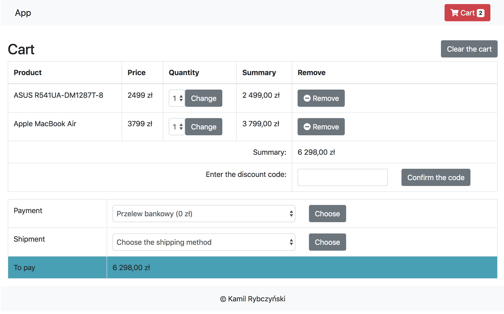

# Simple Symfony 4 cart

## Requirements

- composer
- php >= 7.1
- webpack
- mysql >= 5.6
- nodeJS (8.11.1 and above)

## Installation

### Docker

- run `git clone https://github.com/kamil-rybczynski/cart.git` command
- run `docker-compose up --build`
- log in to app container bash `docker exec -it cart_app /bin/bash`
- run `cp .env .env.local` and type your environment variables, eg. valid mysql port for the Docker
- run `composer install`
- run `php bin/console doctrine:migrations:migrate` to add database tables
- run `php bin/console doctrine:fixtures:load` to load default products, payments, shipments and discount codes data
- tap `exit` command and exit from container terminal
- log in to node container bash `docker exec -it cart_node /bin/bash`
- run `npm install`
- run `npm run dev`
- enjoy that shit in web browser on `http://localhost:8000` URL

### Webserver

- run `git clone https://github.com/kamil-rybczynski/cart.git` command
- run `composer install` command
- run `npm install` command to install frontend dependencies
- add database on your mysql server
- copy `.env` file to `.env.local` and type your local environment variables, eg. mysql connection
- run `php bin/console doctrine:migrations:migrate` to add database tables
- run `php bin/console doctrine:fixtures:load` to load default products, payments, shipments and discount codes data
- map host to `public` folder

## Running

## Docker

- run `docker-compose up`
- enjoy that shit in web browser on `http://localhost:8000` URL

